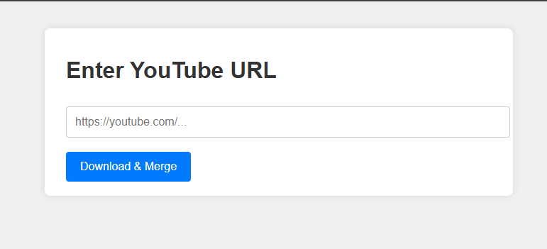
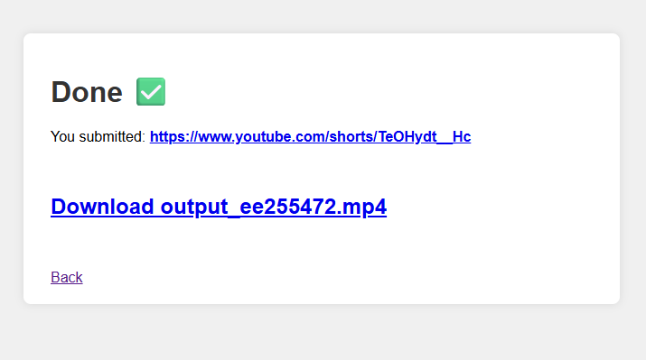

# 🎬 YouTube Downloader & Merger (yt-dlp + ffmpeg + FastAPI)

This project allows users to enter a YouTube URL through a simple web interface. The backend uses `yt-dlp` to fetch video and audio stream URLs separately, then merges them into a single `.mp4` file using `ffmpeg`.

## 🚀 Features

- ✅ Enter any YouTube video URL
- ✅ Automatically fetch video & audio-only streams
- ✅ Merge streams into one `.mp4` file
- ✅ Clean and user-friendly web interface (HTML + CSS)
- ✅ Built using FastAPI

---

## 📸 Preview





---

## 🛠️ Requirements

- Python 3.8+
- [yt-dlp](https://github.com/yt-dlp/yt-dlp)
- [ffmpeg](https://ffmpeg.org/)
- Dependencies from `requirements.txt` (see below)

---

## 📦 Installation

1. **Clone the repo**  
   ```bash
   git clone https://github.com/your-username/yt-downloader-fastapi.git
   cd yt-downloader-fastapi

2. **Create virtual environment (optional but recommended)**
    ```bash
    python3 -m venv venv
    source venv/bin/activate

3. **Install dependencies**
    ```bash
    pip install -r requirements.txt

4. Make sure `yt-dlp` and `ffmpeg` are installed and in your PATH
    ```bash
    yt-dlp --version
    ffmpeg -version

---

## 🧪 Running the App

    uvicorn main:app --reload


---

## 📁 Project Structure

```
├── main.py             # FastAPI backend
├── yt_merge.py         # Merging logic (yt-dlp + ffmpeg)
├── templates/
│   ├── index.html      # Input form page
│   └── result.html     # Result/confirmation page
├── static/
│   └── style.css       # Basic styling
└── requirements.txt    # Python dependencies
```